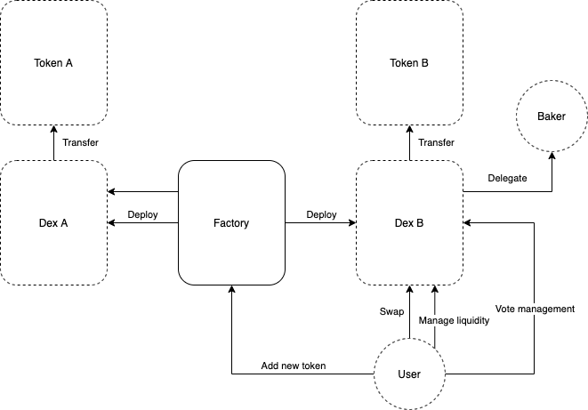

# Description

This project is intended to provide an easy and efficient way to exchange tokens and XTZ on Tezos blockchain in a wide number of directions. Using smart contracts listed in this repo users can add their tokens
to exchange, invest liquidity, and potentially make a profit in a fully decentralized way.

The current implementation supports [FA1.2](https://gitlab.com/tzip/tzip/-/blob/master/proposals/tzip-7/tzip-7.md) and [FA2](https://gitlab.com/tzip/tzip/-/blob/master/proposals/tzip-7/tzip-12.md).

# Architecture



The solution consists of 3 types of contracts:

1. `Factory` - singleton used to deploy new exchange pair;
2. `Dex` - contract for TokenX-XTZ pair exchanges;
3. `Token` - FA token implementation.

# Project structure

```
.
├──  contracts/ # contract sources for FA1.2 compatible version
├──  contractsV2/ # contract sources for FA2 compatible version
├──  test/ # test cases
├──  storage/ # initial storage for contract origination
├──  scripts/ # scripts for dex/factory actions
├──  fixtures/ # deployment & test account keys
├──  misc/ # other sources
├──  README.md # current file
├──  test_cases.md # implemented tests list
├──  test.sh # script for quick development
├──  .gitignore
├──  package.json
└──  Architecture.png
```

# Prerequisites

- Installed NodeJS (tested with NodeJS v12+)
- Installed Ligo:

```
curl https://gitlab.com/ligolang/ligo/raw/dev/scripts/installer.sh | bash -s "next"
```

- Installed node modules:

```
cd quipuswap-core && npm i
```

- Private keys for signing transactions. The unencrypted private keys have to be placed in `key`,`key1`, `key2` file in the `fixtures` directory.
`key` is development key. `key1` and `key2` are used for testing only.

# Usage

Contracts are processed in the following stages:

1. Compilation
2. Deployment
3. Configuration
4. Interactions on-chain

## Compilation

To compile the contracts and generate Michelson you should run:

```
npm run build
```

It will compile `Dex.ligo` to raw Michelson code. This code will be deployed during `Factory.LaunchExchange` call when adding a new exchange-pair. And then compile other contracts and store them in JSON format to deploy with [Taquito](https://tezostaquito.io/) library.

Сompiled `Factory` and `Token` are stored in the `build/` directory.

## Standard

Exchange support FA1.2 and FA2 tokens separately. Set `$npm_package_config_standard` to `fa1.2` or `fa2` according to the goals in `package.json`.

## Factory & Token Deployment

For deployment step the following command should be used:

```
npm run deploy
```

First, we prepare storage for `Factory` contract, and then contracts are deployed to the network.

Addresses of deployed contacts are displayed and stored in JSON format in the `deploy` folder.

## Factory Configuration

Because of the **_gas limit issue_** it is impossible to put all the functions to the code sections of the contract(and execute it). Instead, they are being stored as lambdas in `big_map` structure. Their code cannot be placed in the `storage` due to **_operation size limits issue_**. So each `Dex` function is added to `Factory` by making a separate transaction.

To configure factory run the following command:

```
npm run set-functions
```

After performing step new token pairs can be deployed.

## Exchange Pair Deployment

Each token can have only one exchange pair contract (AKA `Dex`). To add a new token pair `Factory.LaunchExchange` method is called and a new empty `Dex` instance is deployed, initial liquidity is provided. There's a specific command for that:

```
npm run add-tokens
```

After the command is completed, the exchange can be used.

# Entrypoints

## Factory

- `launchExchange(token: address, tokenAmount: nat)`: deploys a new empty `Dex` for `token`, stores the address of the new contract and put initial liquidity; should be called with tezos amount that will be used as intial liquidity.
- `setFunction(func : (dexAction, dex_storage, address) -> (list(operation), dex_storage)), funcIndex: nat`: adds lambda to functions map; the map will be replicated in storage of originated `Dex` contracts.

## Dex

- `default()`: default entrypoint to receive payments; received XTZ are destributed between liquidity providers in the end of the delegation cycle.
- `use(funcIndex: nat, action: dexAction)`: executes the function with index `funcIndex` from `lambdas` with parameters `action`.

Actions have the following parameters (index in the list matches the index in `lambdas`):

0. `initializeExchange(tokenAmount: nat)`: sets initial liquidity, XTZ must be sent.
1. `tezToToken(minTokensOut: nat, receiver: address)`: exchanges XTZ to tokens and sends them to `receiver`; operation is reverted if the amount of exchanged tokens is less than `minTokensOut`.
2. `tokenToTez(tokensIn: nat, minTezOut: nat, receiver: address)`: exchanges `tokensIn` tokens to XTZ and sends them to `receiver`; operation is reverted if the amount of exchanged XTZ is less than `minTezOut`.
3. `withdrawProfit(receiver: address)`: withdraws delegation reward of the sender to `receiver` address.
4. `investLiquidity(minShares: nat)`: allows to own `minShares` by investing tokens and XTZ; the corresponding amount of XTZ should be sent via transaction and amount of tokens should be approved to be spent by `Dex`.
5. `divestLiquidity(minTezDivested: nat, minTokensDivested: nat, sharesBurned: nat)`: divests `sharesBurned` and sends tokens and XTZ to the owner; operation is reverted if the amount of divested tokens is smaller than `minTokensDivested` or the amount of divested XTZ is smaller than `minTezDivested`.
6. `setVotesDelegation(deputy: address, isAllowed: bool)`: allows or prohibits `deputy` to vote with sender shares.
7. `vote(candidate: key_hash, voter: address)`: votes for `candidate` with shares of `voter`.
8. `veto(voter: address)`: votes against current delegate with shares of `voter`.
9. `default()`: default entrypoint to receive payments; received XTZ is distributed between liquidity providers at the end of the delegation cycle.

## Token

Implements two token interfaces [FA1.2](https://gitlab.com/tzip/tzip/-/blob/master/proposals/tzip-7/tzip-7.md) and [FA2](https://gitlab.com/tzip/tzip/-/blob/master/proposals/tzip-7/tzip-12.md).

# Testing

Mocha is used for testing and is installed along with other packages. Testing requires two identities to interact with contracts so their private keys should be placed in the files `fixtures/key`, `fixtures/key1`, and `fixtures/key2`. `Factory`, `Token` and `Token2` contracts have to be deployed before and their addresses have to be stored in `deployed` folder in JSON format. But exchanges for tokens shouldn't be launched (the process is tested inside). Refer to `test.sh` for better understanding.

Run:

```
npm test
```

NOTE: if you want to use a different network, configure `$npm_package_config_network` in `package.json`
